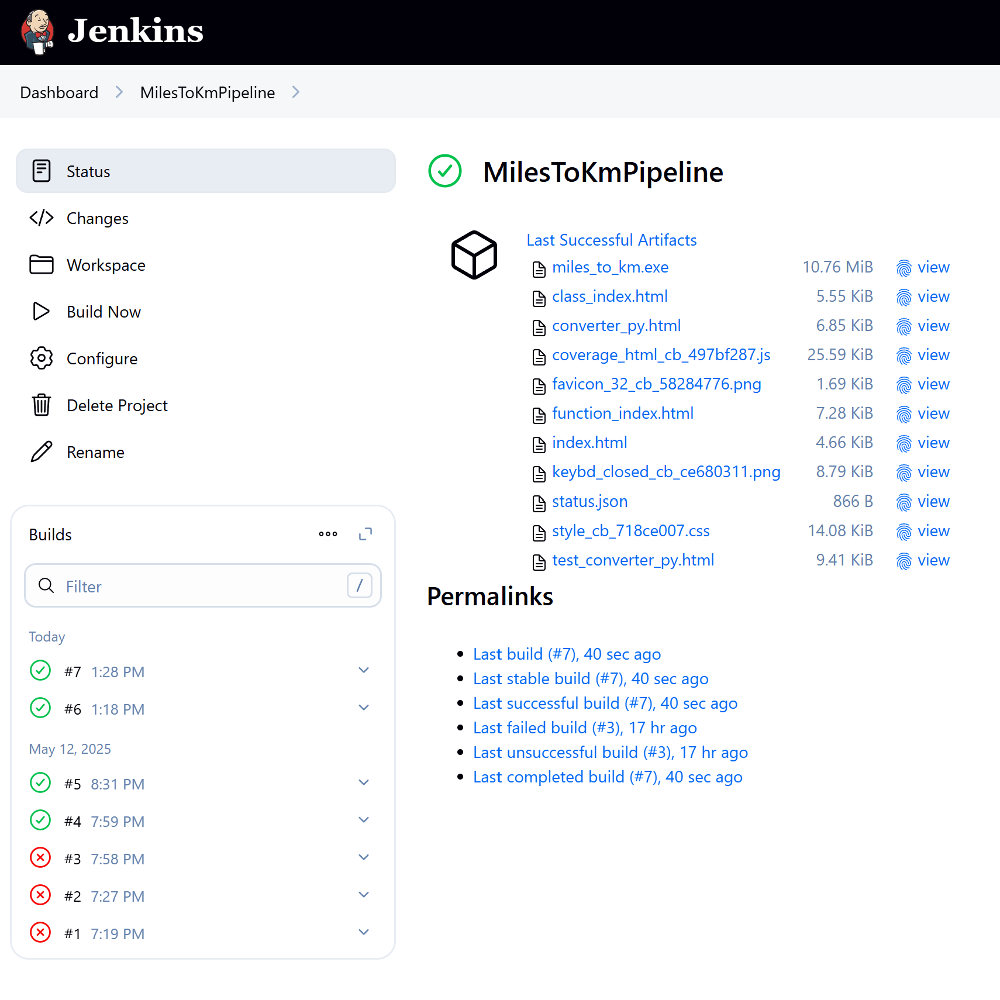
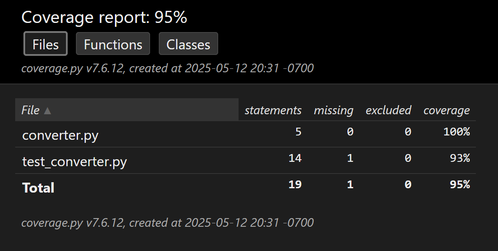
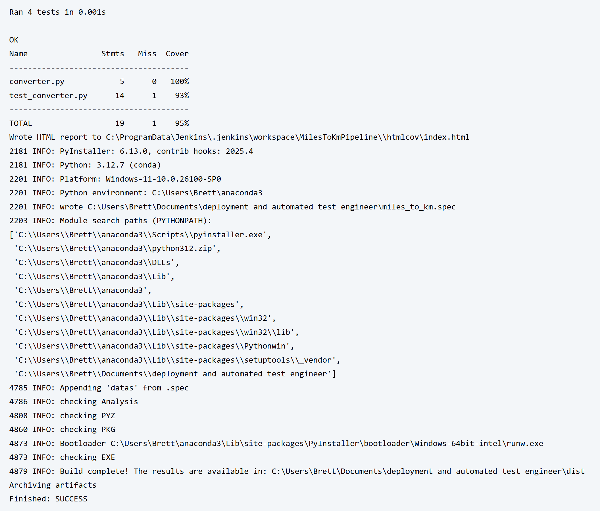
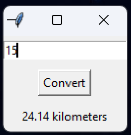
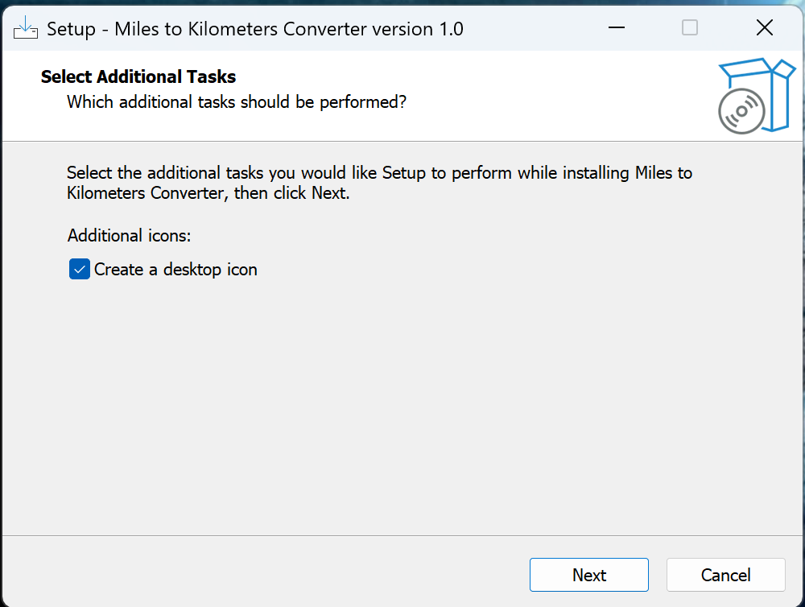
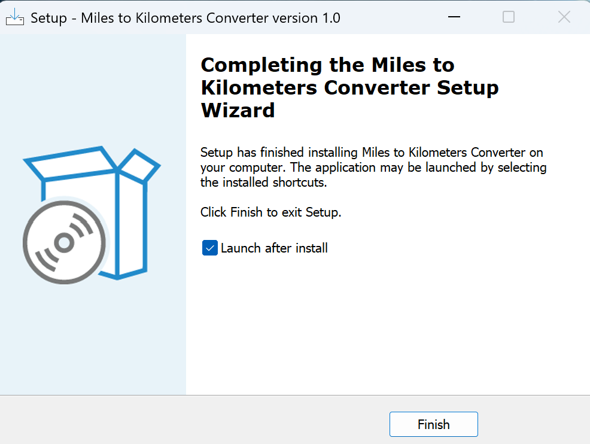

# Miles to Kilometers CI/CD Project

A complete CI/CD pipeline for a GUI-based Python application, designed to demonstrate Windows software deployment, automated testing, and executable packaging — using industry-standard tools.

## Project Overview

This project simulates a real-world deployment scenario for a simple desktop utility app. It includes:

- Automated testing
- Executable packaging
- Jenkins-based continuous integration
- Test coverage reporting
- Windows installer generation

## Tech Stack

- **Python** (Anaconda)
- **Tkinter** – for GUI
- **unittest** – for testing
- **coverage.py** – to measure test coverage
- **PyInstaller** – to package the app into a `.exe`
- **Inno Setup** – to create a Windows installer
- **Git + GitHub** – version control and hosting
- **Jenkins** – CI/CD orchestration

## Pipeline Workflow

1. **Code pushed to GitHub**
2. **Jenkins Build Triggered**:
    - Clone repo from GitHub
    - Activate Anaconda environment
    - Run unit tests using `coverage`
    - Display test coverage in build logs
    - Build a `.exe` using PyInstaller
3. Create a full installer using Inno Setup
4. Archive `.exe` and test report as Jenkins artifacts

> This pipeline is defined both manually (in Jenkins GUI) and in-code using a [`Jenkinsfile`](./Jenkinsfile) for portability and reproducibility.

## 📁 Project Structure

```
miles-to-km-pipeline/
├── Jenkinsfile             # CI/CD pipeline (Pipeline as Code)
├── miles_to_km.py          # GUI entry point
├── converter.py            # Business logic
├── test_converter.py       # Unit tests
├── installer.iss           # Inno Setup script
├── dist/                   # PyInstaller output (.exe)
├── screenshots/            # Portfolio documentation images
```

## Project Screenshots

### Jenkins Job Dashboard  


## Test Coverage Output


### Jenkins Console Output  


### GUI Application  


### Installer Setup  


### Installation Complete  


---

## Key Takeaways

- Created a full Python deployment pipeline using GitHub and Jenkins
- Achieved 95% unit test coverage with `coverage.py`
- Automated `.exe` packaging with PyInstaller in Jenkins
- Archived test reports and builds through Jenkins artifacts
- Installer generated with Inno Setup (manually compiled)

---

## Contact

Created by Brett Orgill  
[GitHub](https://github.com/orgillb) | *Deployment & Automated Testing Engineer Candidate*
